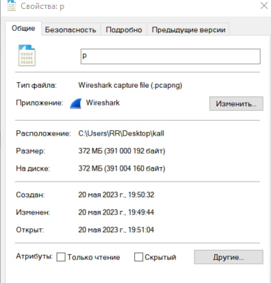

Сбор и аналитическая обработка информации о сетевом трафике
================
Серняев А.О. БИСО-01-20

## Цель работы

1.  Развить практические навыки использования современного стека
    инструментов сбора и аналитической обработки информации о сетевом
    трафике

2.  Освоить базовые подходы блокировки нежелательного сетевого трафика

## План

1.  Получение трафика

2.  Перевод трафика в метаинформацию

3.  Анализ трафика

4.  Определение нежелательного трафика

## Шаги

1\. Получение трафика

С помощью Wireshark было захвачено 372 МБ трафика (файл p.pcapng).



2\. Перевод трафика в метаинформацию

С помощью утилиты zeek была получена метаинформация о трафике (файл
dns.log).

3\. Анализ трафика

Для анализа трафика необходимо получить список нежелательных хостов
(файл hosts.txt)

С помощью Python подготовим файл для анализа:

``` python
bad_hosts = []
with open('hosts') as file:
    for line in file.readlines()[27:]:
        if line[0] == '#':
            continue
        bad_hosts.append(line.split()[1])

hosts = []
with open('dns.log') as file:
    for line in file.readlines():
        if line[0] == '#':
            continue
        try:
            hosts.append(line.split()[9])
        except IndexError:
            continue
bad_count = len([host for host in hosts if host in bad_hosts])
percentile = round(bad_count/len(hosts),3)*100
print("{} вхождений DNS в список нежелательного трафика.".format(str(bad_count)),
"Процент нежелательного трафика: {}%.".format(str(percentile)),sep='\n')
```

4\. Определение нежелательного трафика


## Оценка результата

В результате лабораторной работы мы смогли определить нежелательный
трафик.

## Вывод

Таким образом, мы научились анализировать сетевой трафик и, используя
современный стек инструментов, освоили подход блокировки нежелательного
сетевого трафика на основе чёрного списка.
